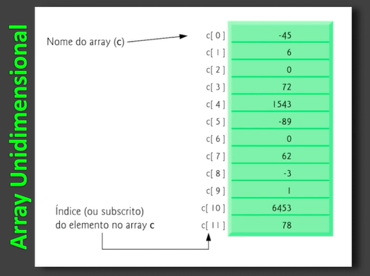
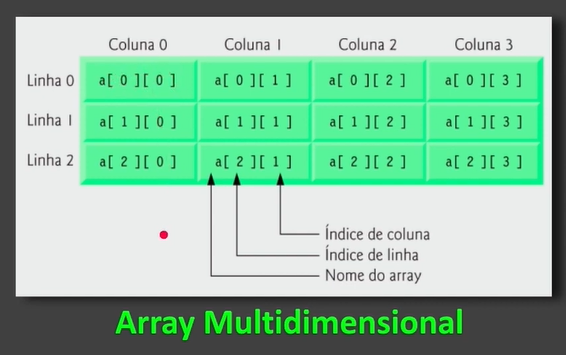
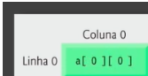

# Arrays

Array é um objeto utilizado para armazenar sequencialmente o mesmo tipo de dado. É uma variável que vai adicionar vários dados de um mesmo tipo.

Quando é criado, nós colocamos um tamanho, definimos um tamanho para o mesmo. Aí ele se mantém até o fim.

## Arrays Unidimensional

É o array mais simples que temos. Uma estrutura com o mesmo tipo de dados em várias possições. 

## Arrays Multidimensional

Aqui já temos um array multidimensional onde é formado por **colunas** e **linhas**. Porém mantendo que ainda só pode ser guardado o mesmo tipo de dado. Também conhecido como matriz.

> Importante!!

É bom saber a nomentclatura dos mesmos.
