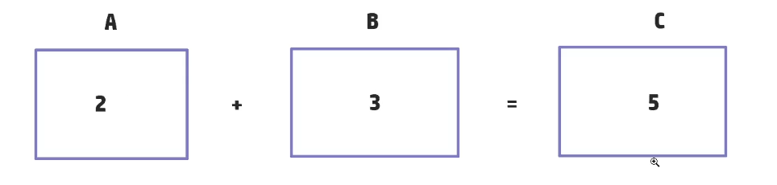

# Pseudocódigo?

# Pseudocódigo?

É uma forma mais genérica de escrever um algoritmo. Utilizando uma linguagem bem simples. 

O pseudocódigo serve como uma ponte entre o pensamento lógico e a programação real, permitindo que desenvolvedores planejem seus algoritmos antes de implementá-los em uma linguagem de programação específica. Por exemplo, podemos descrever um algoritmo simples de soma usando palavras como "INÍCIO", "LEIA", "CALCULE" e "FIM".

## Básico:

Entrada: são os dados

Processamente: forma que é feita

Saída: resultado

